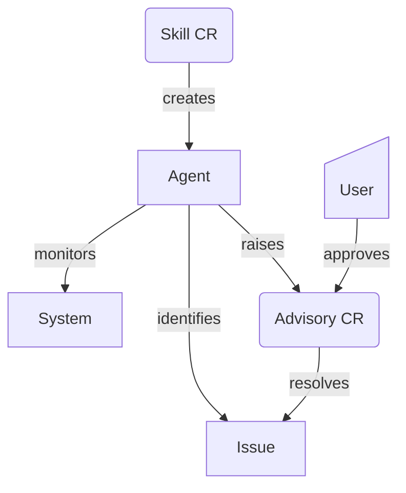

# Khieron - the lightweight Kubernetes-native agentic operator

## Introducing Project Khieron

Khieron[<sup>1</sup>](#why-khieron) (pronounced Kay-ron) brings Kubernetes native operator design, together with a Go native agentic SDK [adk-go](https://adk.dev), to create a lightweight operator that brings together two simple concepts:

* **Skills** - for a flexible and dynamic way of creating single minded single task agents and
* **Advisories**   a Human In the Loop mechanism in a familiar CRD style

See [Examples Skills](#example-skills) below for a comprehensive guide to Skills.

### The lightweight advantage

Commonly cited agentic frameworks for Kubernetes tend to be general purpose behemoths, capable of doing many external facing tasks, but also bringing with them several external systems that and other projects that have a combinatorial effect in increasing complexity.

If you're trying to acheieve a simple task to manage your cluster, it can feel like using a sledgehammer to crack a nut.

By keeping it it simple, Khieron is not trying to give an interactive interface (like a chatbot). Instead it enables granular skills, looped on a regular cadence, with interactivity given through Accept/Reject decisions on Advisories.



### Minimalism throughout

Khieron uses the [Agent Development Tookit (Go version)](https://github.com/google/adk-go) bundled inside the controller, with no bloated Python dependencies (greatly reducing the size of the pod and the startup time), making it suitable for Edge use cases.

There are no child containers to manage. No LiteLLM. No LangChain/LangGrpah. The Docker image is less than 1/10th the size of a comparable Python deployment.

```bash
docker images quay.io/aicatalyst/khieron
IMAGE                               ID             DISK USAGE   CONTENT SIZE   EXTRA
quay.io/aicatalyst/khieron:v0.0.3   87887f780280        265MB         73.9MB
```

### Flexibility

For accesing a backend model, the ADK provides several options for connecting Gemini or Claude or to self hosted models like Gemma.

### Dynamic configuration

The `Skill` CRD is linked to a `ConfigMap` that contains a **Skill.md** file and some `assets`, `scripts` and `references`. Each Skill dynamically creates **one** Agent and runs in a loop doing one task.

Skills follow the standardized approach of the [Agent Skill Specification](https://agentskills.io/specification), and can benefit from the ecosystem support and tooling around that standard.

See the [Skill Development Guide](./docs/skill-developer-guide.md) for more information on how
to develop more skills.

### Internal and External Tooling

The Skill CRD contains an `assets` folder to contain bash scripts used as Externally defined tools.

The controller also has some internally defined tools, written in Go, covering many useful gernal puspose tasks on the Kubernetes API. These are available to the Skills to perform tasks.

> Support for MCP servers as additional tooling will be added in a future release.

### Kubernetes Native Human In the Loop

The creation and management of `Advisories` objects (defined as a CRD) gives an easily manageable interface for humans to see, and approve or reject or comment on some anomaly the Agent finds.

The fact that they are CRDs allow them to have their own control loop intercting with their owner `Skill` as necessary, using its tools and assets.

### Protections on overuse

To protect from the Agent calling the Model too many times, the agent runs every 5 minutes (configurable). Additionally if the agent finds that a tool is returning a failure that needs attention the Agent will pause the Skill.

### Secure by design

Khieron controller runs in a secure locked down pod based off UBI 9 minimal where tools run in non-root accounts.

Skills can only access the Kubernetes API granted to them through specific Service Accounts.

By not having a chatbot interface, the risks of prompt injection attacks commonly associated with agents, is removed.

On Openshift, the deployment uses an Egress Firewall to prevent tools from accessing network resources other than the model API (Gemini) and internal cluster based APIs, thereby reducing the risk of exfiltration by rogue scripts.

### Observable and measurable

Through ADK-go the agent can be integrated to OpenTelemetry (future).

### Non goals

Khieron does not intend to be a comprehensive Agentic framework and is not designed to create a
RAG system.

It does not provide a chat interface.

### Why Khieron

In Greek mythology, [Chiron](https://en.wikipedia.org/wiki/Chiron), also Cheiron or Kheiron or Khieron, (Ancient Greek: Χείρων) was held to be the superlative centaur amongst his brethren since he was called the "wisest and justest of all the centaurs".

> Khieron follows the [rule](https://en.wikipedia.org/wiki/I_before_E_except_after_C) `i` before `e` except after `c` in our interpretation.

## Installation

> The Agent requires a GOOGLE_API_KEY. Create an API Key in [Google AI Studio](https://aistudio.google.com/app/apikey).

Install through Helm with a Google API Key:

```bash
NAMESPACE=khieron-system
GOOGLE_API_KEY=<your key from Google>
helm -n $NAMESPACE install --create-namespace khieron ./dist/khieron/ -f dist/khieron/values.yaml --set googleApiKeySecret.googleApiKey=$GOOGLE_API_KEY
```

> To install on Openshift use `values-openshift.yaml` instead, to activate the Egress Firewall.

## Operation

Install a Skill through a Helm Chart. See the [example skill](./docs/example-skill.md).

### Force a Skill to run now

Skills run every 5 mins (configurable). To force it to run now update its annotation:

```bash
$NAMESPACE=<khieron namespace>
SKILL=<skill name>
kubectl -n $NAMESPACE annotate skill $SKILL khieron.io/run-requested=$(date -u +%FT%TZ) --overwrite
```

### Approve an Advisory

If an advisory is create it will have a `proposal`. To accept the proposal update the Advisory spec:

```bash
$NAMESPACE=<khieron namespace>
$ADVISORY_NAME=<advisory name>
kubectl -n $NAMESPACE patch advisory $ADVISORY_NAME --type merge -p '{"spec":{"approver":"admin"}}'
```

### Tracking usage

The `Skill` will keep track of the token usage everytime it is run. These are visible in the status of the Skill, along with the total usage since it started:

```bash
kubectl -n $NAMESPACE describe skill $SKILL
```

Example output:

```
Spec:                                                                                                   Enableagent:  true                               
  Intervalminute:  5                                 
  Skillconfigref:
    Name:  kueue-idle-allocated-gpus                                           
Status:                                                  
  Lastanalysedat: 2026-05-26T09:51:07Z                                 
  Tokens Last Run:                                      
    Candidates Token Count:  256                         
    Prompt Token Count:      15853                         
    Total Token Count:       16109                         
  Tokens Total:
    Run Count:          1                              
    Total Token Count:  16109
```

### Pausing a Skill

It is not necessary to delte the Skill to pause the agent. This can be done by setting it's `Enableagent` attribute to false.

```bash
$NAMESPACE=<khieron namespace>
$SKILL=<skill name>
kubectl -n $NAMESPACE patch skill $SKILL --type merge -p '{"spec":{"enableagent":false}}'
```

## Example Skills

See [the stalled pod skill](./docs/example-skill.md) for a description on how to build and operator a example skill.

See the [Skill developer guide](./docs/skill-developer-guide.md) to understand best practice in writing skills
for Khieron.

## Developer Getting Started

Create a secret to keep this key:

```bash
NAMESPACE=<your-namespace>
GOOGLE_API_KEY=<your api key>
kubectl create namespace $NAMESPACE
kubectl create secret generic google-api-key \
  --from-literal=GOOGLE_API_KEY="$GOOGLE_API_KEY" \
  -n $NAMESPACE
```


### Prerequisites
- go version v1.24.0+
- docker version 17.03+.
- kubectl version v1.11.3+.
- Access to a Kubernetes v1.11.3+ cluster.

### To Deploy on the cluster
**Build and push your image to the location specified by `IMG`:**

```sh
make docker-build docker-push IMG=<some-registry>/khieron:tag
```

**NOTE:** This image ought to be published in the personal registry you specified.
And it is required to have access to pull the image from the working environment.
Make sure you have the proper permission to the registry if the above commands don’t work.

**Install the CRDs into the cluster:**

```sh
make install
```

**Deploy the Manager to the cluster with the image specified by `IMG`:**

```sh
make deploy IMG=<some-registry>/khieron:tag
```

> **NOTE**: If you encounter RBAC errors, you may need to grant yourself cluster-admin
privileges or be logged in as admin.

**Create instances of your solution**
You can apply the samples (examples) from the config/sample:

```sh
kubectl apply -k config/samples/
```

>**NOTE**: Ensure that the samples has default values to test it out.


### To Uninstall
**Delete the instances (CRs) from the cluster:**

```sh
kubectl delete -k config/samples/
```

**Delete the APIs(CRDs) from the cluster:**

```sh
make uninstall
```

**UnDeploy the controller from the cluster:**

```sh
make undeploy
```

## Project Distribution

Following the options to release and provide this solution to the users.

### By providing a bundle with all YAML files

1. Build the installer for the image built and published in the registry:

```sh
make build-installer IMG=<some-registry>/khieron:tag
```

**NOTE:** The makefile target mentioned above generates an 'install.yaml'
file in the dist directory. This file contains all the resources built
with Kustomize, which are necessary to install this project without its
dependencies.

2. Using the installer

Users can just run 'kubectl apply -f <URL for YAML BUNDLE>' to install
the project, i.e.:

```sh
kubectl apply -f https://raw.githubusercontent.com/<org>/khieron/<tag or branch>/dist/install.yaml
```

### By providing a Helm Chart

1. Install [helmify](https://github.com/arttor/helmify) and generate the chart from the kustomize output:

```sh
go install github.com/arttor/helmify/cmd/helmify@latest
make helm-chart
```

2. The chart is generated under `dist/chart/`. Users can install it with:

```sh
helm install khieron dist/chart -n <namespace>
```

**NOTE:** If you change the project, regenerate the Helm chart
using the same commands above to sync the latest changes. Review
any custom values previously added to `dist/chart/values.yaml`
and reapply them after regeneration.

## Contributing
// TODO(user): Add detailed information on how you would like others to contribute to this project

**NOTE:** Run `make help` for more information on all potential `make` targets

More information can be found via the [Kubebuilder Documentation](https://book.kubebuilder.io/introduction.html)

## License

Copyright 2026.

Licensed under the Apache License, Version 2.0 (the "License");
you may not use this file except in compliance with the License.
You may obtain a copy of the License at

    http://www.apache.org/licenses/LICENSE-2.0

Unless required by applicable law or agreed to in writing, software
distributed under the License is distributed on an "AS IS" BASIS,
WITHOUT WARRANTIES OR CONDITIONS OF ANY KIND, either express or implied.
See the License for the specific language governing permissions and
limitations under the License.
